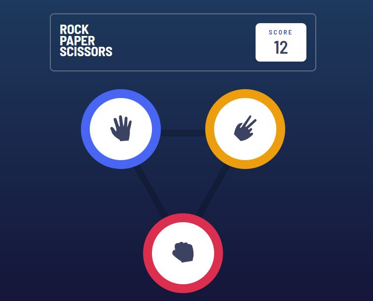
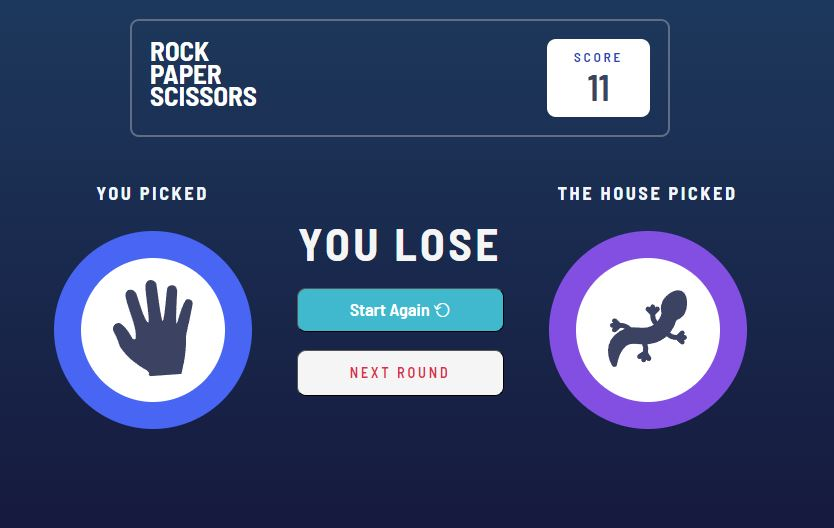

# Frontend Mentor - Rock, Paper, Scissors solution

This is a solution to the [Rock, Paper, Scissors challenge on Frontend Mentor](https://www.frontendmentor.io/challenges/rock-paper-scissors-game-pTgwgvgH).

## Overview

### The challenge

Users should be able to:

- View the optimal layout for the game depending on their device's screen size
- Choose easy or difficult level of the game;
- Play Rock, Paper, Scissors against the computer if user chooses easy level;
- Play Rock, Paper, Scissors, Lizard, Spock against the computer if user chooses easy level;
- User can see rules of each level, by clicking the button bellow;
- Start game from the start while playing;
- Each move has a score, if user's total score is 24, the user wins, if user's total score is 0, the computer wins and the user loses;
- After game is over, user can start game from the start;

### Screenshot

)](./screenshot.jpg)
)](./screenshot.jpg)
](./screenshot.jpg)
](./screenshot.jpg)

### Links

- Live Site URL: [Add live site URL here](https://your-live-site-url.com)

## My process

### Built with

- React;
- React Router;
- Vite;

